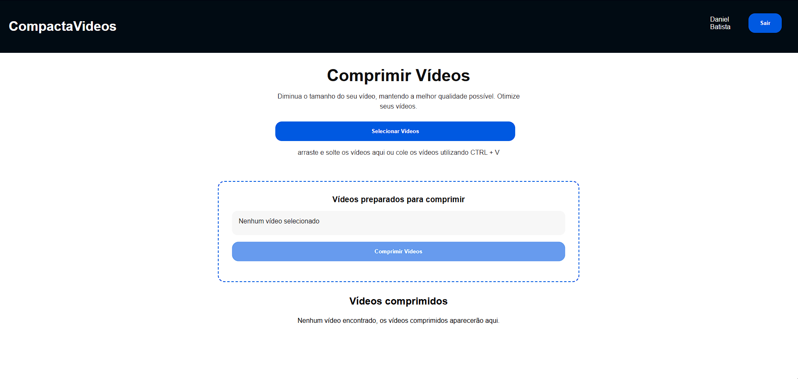

# CompactaVideos

Trata-se do Frontend uma aplicação que possibilita os usuários anexem arquivos, que serão comprimidos e ficarão armazenados na nuvem através do [Google Cloud Storage](https://cloud.google.com/storage/docs/). Estes vídeos anexados poderão ser visualizados, excluídos ou baixados. A aplicação possui uma sessão de Login e criação de usuário. Para rodar esta aplicação, será necessário rodar em conjunto a [API](https://github.com/danielbped/video-compressor).

# Sumário

- [Tecnologias utilizadas](#tecnologias)
- [Instruções para rodar o projeto](#instrucoes)
  - [.env](#env)
  - [Iniciando a aplicação](#start)
- [Demonstração](#demo)
- [Testes unitários](#testes)

## Tecnologias utilizadas <a name="tecnologias"></a>
- **[ReactJS](https://react.dev/)**: Uma biblioteca JavaScript de código aberto utilizada para construir interfaces de usuário (UI). Desenvolvida pelo Facebook, ela é baseada em componentes reutilizáveis, permitindo a construção de interfaces dinâmicas e interativas de forma eficiente.
- **[TypeScript](https://www.typescriptlang.org/)**: Um superconjunto de JavaScript que adiciona tipagem estática opcional ao código. Ele ajuda os desenvolvedores a detectar erros mais cedo durante o desenvolvimento e oferece ferramentas avançadas para trabalhar em projetos de grande escala, melhorando a manutenibilidade e escalabilidade do código.
- **[Styled Components](https://styled-components.com/)**: Uma biblioteca para React e React Native que permite escrever estilos CSS diretamente dentro de componentes JavaScript. Isso facilita a criação e o gerenciamento de estilos, além de fornecer recursos como props dinâmicas e escopo encapsulado para estilos.
- **[Axios](https://axios-http.com/ptbr/docs/intro)**: Uma biblioteca JavaScript para fazer requisições HTTP a partir do navegador ou Node.js. Ele fornece uma API simples e concisa para lidar com solicitações e respostas HTTP, suportando várias funcionalidades, como interceptadores, cancelamento de requisições e transformações de dados.
- **[Vite](https://vitejs.dev/)**: Um construtor de aplicações web moderno e rápido, desenvolvido principalmente para projetos usando Vue.js, mas também é compatível com outras estruturas como React e Svelte. Ele oferece um ambiente de desenvolvimento extremamente rápido e eficiente, com recarga rápida (hot module replacement) e suporte a módulos ES.
- **[React Query](https://tanstack.com/query/latest)**: Uma biblioteca para gerenciamento de dados em aplicações React. Ela simplifica o gerenciamento de dados assíncronos, como solicitações HTTP, cache de dados e atualizações em tempo real, fornecendo uma API simples e intuitiva para lidar com esses cenários comuns no desenvolvimento de aplicações web.
- **[Jest](https://jestjs.io/pt-BR/)**: Framework de teste em JavaScript com foco na simplicidade.
- **[React Testing Library](https://testing-library.com/docs/react-testing-library/intro/)**: Framework de teste em React.
- **[Google Cloud](https://cloud.google.com/)**: Uma plataforma de computação em nuvem do Google, oferecendo uma ampla gama de serviços para desenvolvimento, armazenamento e implantação de aplicações. Com infraestrutura global e recursos avançados, é uma escolha popular para migrar cargas de trabalho para a nuvem.

# Instruções para rodar o projeto <a name="instrucoes"></a>

### Será necessário ter instalado na sua máquina:

```
  Git
  Node v22.18.0
```

- Clone o repositório com o comando git clone:

```
  git clone git@github.com:danielbped/video-compressor-frontend.git
```

- Entre no diretório que acabou de ser criado:

```
  cd video-compressor-frontend
```

## .env <a name="env"></a>

Para que a aplicação funcione corretamente, algumas variáveis de ambiente precisam ser configuradas, basta seguir os passos a seguir.

Na raiz do projeto, basta renomear o arquivo .env.example para .env, lá já se encontram todas as variáveis necessárias para iniciar o banco de dados.

Na pasta da aplicação, já existe um arquivo .env.example que deverá ser renomeado para .env, dentro dele temos as seguintes informações:
```
VITE_API_URL="http://localhost:3000"
VITE_SECRET_KEY_JWT="video-compressor"
```

Os dados não precisam ser alterados, caso a aplicação da [API](https://github.com/danielbped/video-compressor) esteja sendo utilizada da forma configurada previamente.

- Para o projeto funcionar na sua máquia, será necessário instalar suas dependências, para isso, utilize **npm install**:

      npm install

- Pronto, agora o projeto está pronto para ser rodado localmente, utilizando o comando **npm run dev**:

      npm run dev

> ⚠️ A aplicação, por definição, estará rodando na porta 5173 ⚠️

- Agora basta entrar no endpoint http://localhost:5173/ ou http://127.0.0.1:5173/ para acessar a aplicação

> ⚠️ Para que a aplicação funcione corretamente, é necessário rodar a [API](https://github.com/danielbped/video-compressor) em conjunto.

# Demonstração <a name="demo"></a>

## Login


## Novo usuário


## Compressor



## Testes Unitários <a name="testes"></a>

Todos os componentes estão devidamente testados, os testes podem ser rodados com o seguinte comando

      npm test
